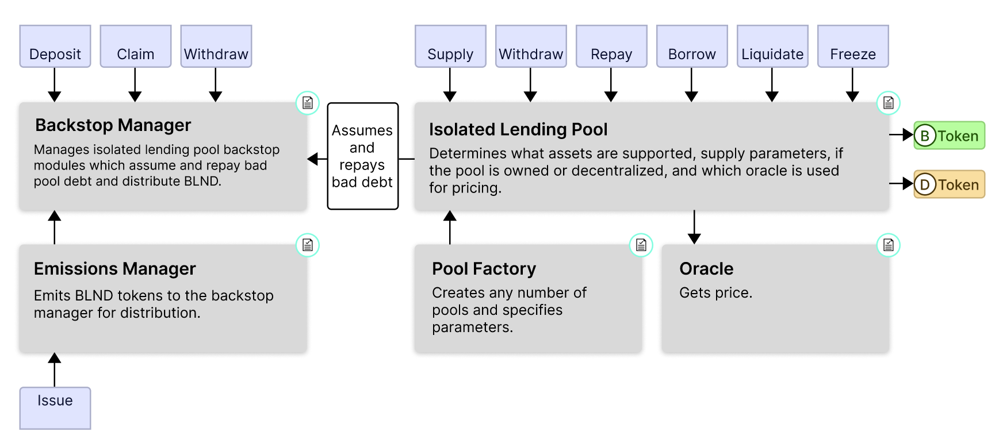
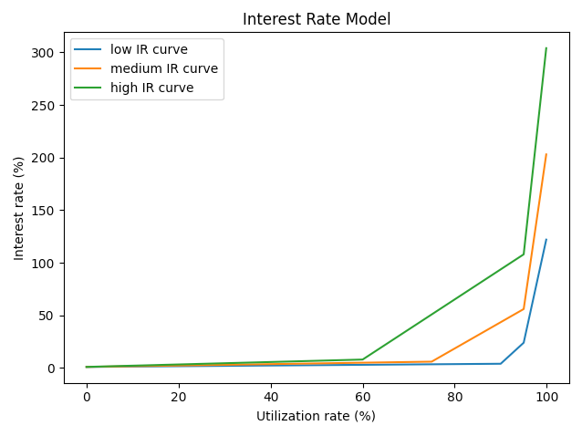

# Blend Whitepaper

- [Abstract](#abstract)
- [Introduction](#introduction)
- [Protocol Specification](#protocol-specification)
    - [Isolated Lending Pools](#isolated-lending-pools)
    - [Backstop Module](#backstop-module)
    - [Lending and Borrowing](#lending-and-borrowing)
    - [Interest Rates](#interest-rates)
    - [Liquidations](#liquidations)
- [Governance and Decentralization](#governance-and-decentralization)
- [References](#references)

## Abstract

This paper introduces a universal liquidity protocol primitive, Blend. A liquidity protocol primitive enables the permissionless creation of lending pools to quickly respond to emerging market needs. Applications, industries, and users can utilize this primitive to create isolated lending pools that best serve their niche. Blend is an ungoverned, modular, liquidity protocol primitive that does not compromise on security or capital efficiency.

## Introduction

Decentralized money markets act as a cornerstone for healthy crypto-economic systems. They trustlessly facilitate the flow of capital to wherever it is most productive, increasing capital efficiency and generating interest along the way. Aave and Compound prove these products' value with their success in the Ethereum ecosystem. Since their inception during the early stages of decentralized finance (DeFi), they quickly became two of the industry’s largest and most used DeFi protocols. Aave remains one of the largest, peaking at approximately $30 billion in liquidity [[1](https://github.com/aave/aave-v3-core/blob/master/techpaper/Aave_V3_Technical_Paper.pdf)].

Despite their usefulness, current money markets fall short in terms of flexibility. Users want to utilize a wide range of their crypto assets in money markets. However, supporting risky assets, especially as collateral, can put protocol funds at risk. Aave and Compound forgo flexibility and have extensive governance systems that ensure any asset meets well-defined criteria before adding it to their markets [[2](https://medium.com/gauntlet-networks/gauntlets-parameter-recommendation-methodology-8591478a0c1c), [3](https://docs.aave.com/risk/asset-risk/introduction)]. Other protocols like Euler and Rari have novel approaches for managing permissionless listings that segment asset risk [[4](https://docs.euler.finance/getting-started/white-paper#permissionless-listing)]. Unfortunately, these approaches can lead to liquidity fragmentation and low capital utilization.

Blend represents a new, more primitive approach to decentralized money market protocols. It enables the permissionless creation of isolated lending pools, ensuring maximum flexibility and accessibility. Blend avoids the normal pitfalls of permissionless lending markets by using a market-driven backstop system to curate pools, ensuring appropriate risk levels, and using a dynamic interest rate model to preserve capital efficiency.

## Protocol Specification

### System Diagram

### Isolated Lending Pools

Blend’s core component is its isolated lending pools. These pools facilitate lending and borrowing between users for a set of supported assets. Anyone can deploy an isolated pool using Blend, allowing the protocol to quickly adapt to the needs of constantly evolving digital economies. The deployer sets parameters that govern the pool’s supported assets, acceptable loan-to-value ratios, target utilization rates, and price oracle.

Blend ensures asset risk segmentation by logically separating positions in isolated pools from all other pools, meaning collateral and debt associated with one isolated pool does not apply to others. Thus, bad debt, liquidations, or bad oracles in one pool cannot spill over and harm users in another pool. As a result, the adaptability offered by Blend’s permissionless deployment does not expose protocol users to unknown risks.

There are two types of isolated pools, standard and owned:

#### Standard Pools

Standard pool parameters are immutable after deployment. As such, any parameters defined by the deployer, like the support assets, are fixed. This creates a trust-minimized money market environment, lowering the risk-surface for users.

#### Owned Pools

Owned pools are isolated lending pools where a delegated address can modify pool state and most pool parameters. Notably, they cannot modify the oracle contract address parameter or the backstop take rate parameter. This restriction prevents excessive damage to users by malicious or compromised pool owners. Owned pools are attractive choices for DAOs or platforms that want to offer their own lending market.

### BLND Token

BLND is Blend’s protocol token; its primary purpose is backstopping and managing lending markets through the backstop module.\

### Backstop Module

The backstop module is a pool of funds that acts as first-loss capital for each isolated lending pool. Each pool's backstop funds are specific to themselves, and used extensively in pool management.

#### Depositing and Withdrawing Funds

Users can deposit BLND or BLND:USDC liquidity pool tokens into a backstop module for an isolated lending pool. They can withdraw their deposits at any time. However, initiating a withdrawal places the funds into a withdrawal queue, where they remain for 30 days. After the queue expires, users can withdraw their funds as long as the backstop module has no remaining bad debt. The queue period ensures the backstop module can effectively perform its function as lender insurance.

#### Lending Pool Interest Sharing

In exchange for insuring pools, backstop module depositors receive a portion of the interest paid by pool borrowers unless their deposit is currently queued for withdrawal. The percent of borrower interest paid to the backstop module depends on the BackstopTakeRate parameter, which is set on pool creation and validated such that it is set within [0.05, 0.7]. The portion of interest paid to backstop module depositors should be set higher for high-risk pools and lower for low-risk pools, reflecting their differing insurance requirements.

#### Covering Bad Debt

Pool backstop modules act as first-loss capital by paying off any bad debt the pool takes on. If a user has bad debt it’s transferred to the backstop module, which auctions off it’s holdings to pay it off. Any remaining bad debt is socialized among lenders if backstop module deposits are insufficient to cover it.

### Lending and Borrowing

#### Lending Assets

Any asset supported by a given pool can be deposited into that pool. A deposit is represented by an ERC-20 token, or bToken, which entitles the holder to a share of the total deposited assets (similar to Compound’s cTokens [[5](https://compound.finance/docs/ctokens)]).

The lender receives bTokens for depositing amount of an asset based on the following exchange rate:

$$
bTokenLenderRate = 1+(bTokenRate-1)*(1-BackstopTakeRate)
$$

$$
\tag{1}
bTokens = \frac{amount}{bTokenLenderRate}
$$

The bTokenRate is an internal value that tracks how much interest has accrued to one bToken over the pool’s lifetime. For example, if 10% interest has been generated by a bToken, its bTokenRate will be 1.1. bTokenLenderRate is the amount of interest that has been allocated to lenders from the bTokenRate.

Lenders can include a “sponsor” field on their deposit transaction to turn it into a sponsored deposit. Including a sponsor causes the transaction to send up to 0.5% (based on pool settings) of the resulting bTokens to the specified sponsor. This functionality incentivizes wallets and other entities to host Blend UIs, as they can charge a small deposit fee.

#### Borrowing Assets

Any asset supported by the pool can be borrowed from the pool as long as the borrower has sufficient collateral deposited. In the event of a price change, borrowers risk liquidation if the collateral they have posted is no longer sufficient to cover their outstanding liabilities.

Borrowed assets are tracked with an ERC-20 token, or dToken (similar to Aave’s debtToken), which represents an outstanding liability for the holder against the pool for the borrowed token. These tokens are non-transferable and can only be removed by repaying the borrowed amount to the pool.

The borrower receives dTokens for borrowing amount of an asset from the pool based on the following exchange rate:

$$
dTokenRate = \frac{(bTokenTotalSupply * bTokenRate - PoolAssetBalance)}{dTokenTotalSupply}
$$

$$
\tag{2}
dTokens=\frac{amount}{dTokenRate}
$$

The value of assets a user can borrow from a pool is based on their Borrow Limit. Each collateral position in the pool increases their borrow limit by the value of the position multiplied by its Collateral Factor. Each liability position decreases their borrow limit by the value of the position divided by its Liability Factor. Each asset's collateral and liability factor is set on pool creation and bounded within [0.00, 1.00].

$$
\tag{3}
Borrow Limit = \sum(PositionValue_{collateral} * AssetFactor_{collateral}) -\sum(\frac{PositionValue_{Liability}}{AssetFactor_{Liability}})
$$

Supporting both a collateral and liability factor gives pool creators a large amount of flexibility regarding the level of leverage they permit for different positions. For example, if a pool creator wants to support high leverage for fiat borrows collateralized with fiat, but not crypto borrows collateralized with fiat, they can set all fiat collateral and liability factors to 0.98 and crypto collateral and liability factors to 0.765. This would give fiat borrowers using fiat as collateral up to 25x leverage, but crypto borrowers using fiat as collateral only up to 4x leverage. This level of flexibility is not possible using only collateral factors.

#### Utilization Caps

To protect lenders from oracle instability or collateral asset exploits (infinite mints of a bridge asset etc.), pool creators can add utilization caps to assets primarily meant to be collateral assets. These caps prevent the asset from being borrowed above a certain utilization level. This safety feature, combined with backstop module first-loss capital, keeps lenders safe even in worst-case scenarios.

### Interest Rates

Each pool algorithmically sets each of its assets’ interest rates based on each asset’s utilization ratio. The interest rate adjusts dynamically to stabilize the utilization to a constant target utilization ratio. The utilization ratio of an asset is defined by:

$$
\tag{4}
U=1- \frac{Balance_{Pool}}{bTokenTotalSupply * bTokenRate}
$$

Each asset in the pool defines a target utilization rate and three initial interest rates: at the target utilization ratio $U_T$, 95% utilization ratio, and 100% utilization ratio. The initial rates are used to calculate three slope values $R_1$, $R_2$, and $R_3$. These values define an interest rate model, similar to Aave’s[[6](https://github.com/aave/aave-protocol/blob/master/docs/Aave_Protocol_Whitepaper_v1_0.pdf)], but with three distinct legs:

$$
\tag{5}
IR(U)=
    \begin{cases}
        RM*(R_{base}+\frac{U}{U_T}R_1) & \text{if } U\leq U_T\\
        RM*(R_{base}+R_1+\frac{U-U_T}{0.95-U_T}R_2) & \text{if } U_T\lt U\leq 0.95\\
        RM*(R_{base}+R_1+R_2)+\frac{U-0.95}{0.05}R_3 & \text{if } 0.95\lt U\\
    \end{cases}
$$

$$
\begin{align*}
    \text{where}\\
    &RM =\text{Rate modifier for pool asset}\\
    &R_{base} =\text{Protocol's base interest rate (0.01)}\\
    &R_1, R_2, R_3 =\text{Interest rate slope values for pool asset}
\end{align*}
$$

_Figure 1: Interest rate curve examples for various asset classes where low curve has ($U_T$=0.9, $R_1$=0.03, $R_2$=0.2, $R_3$=1), medium curve has ($U_T$=0.75, $R_1$=0.05, $R_2$=0.5, $R_3$=1.5), high curve has ($U_T$=0.6, $R_1$=0.07, $R_2$=1, $R_3$=2), and the Rate Modifier is 1._

The Rate Modifier is a reactive value that adjusts the interest rate the pool charges for borrowing the asset to achieve a target utilization rate. The modifier slowly sums the error in utilization over blocks, compensating for any steady-state error as a result of the user-defined initial interest rates. The value is bounded between _[0.1, 100]_ to limit the effective interest rate change possible and avoid potential integral windup that could cause instability. The updated modifier is calculated as follows:

$$
Util Rate Error = \Delta blocks * (U_T-U)
$$

$$
\tag{6}
Rate Modifier = Util Rate Error * Reactivity Constant + Rate Modifier
$$

The Target Utilization Ratio and Reactivity Constant are constant values provided on pool creation for each asset supported by the pool. They are validated such that Target Utilization Rate is within _[0.5, 0.95]_ and Reactivity Constant is within _[10e-6, 10e-4]_.

Interest rates are accrued discretely over the blocks since the last accrual has occurred. The following formula depicts how a loan value will get updated for a given interest rate, $R$:

$$
\tag{7}
Loan Value = Loan Value * (1 + R * \frac{\Delta blocks}{Blocks Per Year})
$$

Accruing discretely significantly lessens the gas required to accrue a given liability, and only slightly underestimates the full liability compared to a continuously compounding loan over a ten year time frame. Thus, it is an appropriate trade off for keeping contract calls cheap.

This dynamic interest rate model responds more efficiently to changing cost of capital in the crypto lending space than a traditional interest curve model. For example, if USDC borrowing rates fall in other protocols, we can also expect the utilization of USDC in Blend markets to fall. Thanks to the dynamic interest rate model, the Blend markets will automatically adjust their _Rate Modifier_ for USDC, lowering interest rates and driving utilization rates back up. Thus, Blend’s interest rate model enables markets to retain their goal utilization ratios and levels of capital efficiency without requiring any intervention from a governance system.

### Liquidations

In the event a borrower’s outstanding liabilities to a given pool exceed the borrowing capacity of their collateral in that pool, the borrower can be liquidated. Liquidations are performed to reduce the chance a borrower defaults on their loan, causing a permanent loss of lender funds.

Blend uses gentle dutch auctions to liquidate borrowers without over-penalizing them or exposing them to oracle risk.

#### Auction Initiation

Any user can initiate a liquidation auction on an account that has exceeded its borrow capacity for a pool. Liquidation initiators choose user collateral and liabilities involved in the liquidation. The auction will sell the user collateral (the lot of the auction) in return for the user liabilities (the bid of the auction).

However, the protocol imposes the following requirements on the liquidation creator:

1. The value of liabilities repaid must be less than a calculated _Target Liquidation Amount_ to prevent user's from getting over-liquidated.

2. If all user liabilities are not being repaid, the value of all liabilities repaid must be greater than 90% of the _Target Liquidation Amount_ to increase the likelihood the liquidation removes all excessively borrowed funds.

3. The value of all collateral sold must be within 1x to 2x _Target Liquidation Amount_ unless all of the user's collateral is being sold to ensure the gradual dutch auction mechanism can find a valid price.

The _Target Liquidation Amount_ ($TLA$) defines an appropriate volume of liabilities to liquidate based on a liquidation premium, $p$, the collateral being sold, and the liabilities being purchased by the protocol. The $TLA$ aims for the user being liquidated to end up 3% over collateralized according to the protocol. It is calculated by:

$$
p = TBD
$$

$$
\tag{8}
TLA=\frac{1.03 * L_o - C_o}{1.03 * \overline{L_f}^{(-1)} - p\overline{C_f}}
$$

$$
\begin{align*}
    \text{where}\\
    &L_o=\text{Total value of the user's liabilities outstanding}\\
    &C_o=\text{Total value of the user's collateral outstanding}\\
    &\overline{L_f}=\text{Weighted average liability factor of the liability being auctioned}\\
    &\overline{C_f}=\text{Weighted average collateral factor of the collateral being auctioned}\\
\end{align*}
$$

#### Auction Duration

After the auction initiation, a lot modifier ($LM$) value begins scaling from zero to one based on how much time has passed since initiation. This value governs the percent of the auctioned user’s collateral the liquidator will receive upon filling the auction (1.00 being 100%). Once the lot modifier reaches one, a bid modifier ($BM$) value begins decreasing from one to zero. The bid modifier governs what percentage of the input liability amount the liquidator must repay when they fill the auction (1.00 being 100%). These modifiers are calculated based on the number of blocks that have passed since the auction was created:

$$
\tag{9}
LM(\Delta b)=
    \begin{cases}
        \lfloor \frac{\Delta b}{2} \rfloor & \text{if } \Delta b\leq 200\\
        1 & \text{if } \Delta b\gt 200\\
    \end{cases},
\hspace{2mm}
BM(\Delta b)=
    \begin{cases}
        1 & \text{if } \Delta b\leq 200\\
        \lfloor \frac{\Delta b}{2} \rfloor& \text{if } \Delta b\gt 200\\
    \end{cases}
$$

$$
\begin{align*}
    \text{where}\\
    &\Delta b=\text{The number of blocks that have passed since the auction was initialized}\\
\end{align*}
$$

#### Auction Fill

At any point, a liquidator can fill the auction and repay the bid modifier adjusted auction liability in exchange for the lot modifier adjusted auctioned collateral.

### Price Oracles

Price oracles are used extensively to determine whether a borrower’s outstanding and potential liabilities are sufficiently collateralized. Each isolated lending pool specifies a price oracle to use on creation. The pool creator can select any deployed oracle contract as long as the oracle implements the expected BlendOracle trait, and all assets supported by the pool can fetch USD-denominated prices from the oracle.

## Governance and Decentralization

### Overview

Blend is an ungoverned protocol. That is, no DAO or organization is required to manage the protocol and BLND does not have voting power. Instead, social governance and market forces surrounding backstop modules drive changes.

DAOs are historically bureaucratic, making it difficult for them to support the speed and flexibility required by the DeFi ecosystem. The primary reason DAOs are used by lending protocols is their ability to control and underwrite risk. Blend’s ungoverned model achieves similar levels of risk management using distributed market consensus rather than explicit DAO consensus. Thus, Blend can eschew the traditional DAO model in favor of a market-driven approach that allows it to respond much faster to market changes.

### Pool Management

Besides insuring pools, backstop modules are crucial for curating and managing pools. They perform this function by triggering modification of their pool’s state, which governs whether the pool is active (whether borrowing and depositing is allowed) or not.

#### Pool State

Blend’s isolated lending pools have three possible states that determine how they function:

1. _Active_: All operations are enabled
2. _On Ice_: Only borrowing is disabled
3. _Frozen_: Both borrowing and depositing are disabled

Pools start on ice, and their state can change depending on the state of their respective backstop module.

1. _Active_ can be set if less than 25% of backstop module deposits are in the withdrawal queue and module deposits net queued withdrawals are above the backstop threshold.
2. _On Ice_ can be set if 25% or more of the backstop module deposits are in the withdrawal queue or if module deposits, including queued withdrawals, are under the backstop threshold.
3. _Frozen_ can be set if 50% or more of the backstop module deposits are in the withdrawal queue.

Pool state is modified based on Backstop module status because backstop module depositors are first-loss capital for pools and thus are the most exposed to pool risk levels. If pool risk levels change, it is expected backstop module depositors will be the first to react.

In the case of owned pools, the pool owner can set their pool to on ice or frozen, as they are also expected to monitor pool risk levels.

#### Backstop Threshold

The backstop deposit threshold required to activate pools is 1 million BLND tokens. BLND:USDC liquidity pool token deposits count as the number of BLND tokens within them toward this threshold.

#### Pool Migration

Due to the immutable nature of standard isolated lending pools, if new parameters are required, a new pool must be deployed, and users must be migrated to it. Migrations are especially urgent if the old pool is using an oracle contract that is being shut down. To migrate users, someone first needs to create the new pool, then inform the backstop module depositors of the old pool what the new pool is, and why they should migrate. Since an outdated parameter could jeopardize backstop module deposits, depositors should be more than happy to migrate. Once they begin the migration process by queueing their deposits for withdrawal, the pool can be turned off using pool management functions. This will force lenders and borrowers to migrate to the new pool to continue their operations.

### BLND Emissions

BLND tokens are emitted by the protocol to users. An emissions contract controls all protocol emissions, and the backstop module determines how they get distributed. In total, the protocol emits 500,000 BLND tokens weekly. The tokens are distributed to two types of users: backstop depositors and isolated pool borrowers.

#### Backstop Depositor Emissions

Users who deposit BLND:USDC LP tokens into the backstop module are eligible to receive a share of 70% of the total BLND emissions. All BLND:USDC LP token deposits are eligible for emissions regardless of the isolated pool the token is deposited in or the withdrawal queue status. Each BLND:USDC LP token deposit receives emissions proportional to the total BLND:USDC LP tokens deposited by all users in the backstop module.

#### Isolated Pool Borrower Emissions

Users who borrow from active Isolated Pools are eligible to receive a share of 30% of the total BLND emissions. The backstop module splits the share of weekly emissions among these pools proportionally to their backstop sizes. From there, pools split their emission allowance to all borrowers based on the assets emission rate. When these emissions are claimed, they are deposited into the backstop module of the pool the user was borrowing from.

#### Emissions as Balancing Force

The protocol sending emissions to pool borrowers creates a necessary correlation between the pool’s backstop size and the pool’s total value locked (TVL). If the pool’s backstop module size outpaces the pool’s TVL, more emissions will be directed towards the borrowers of the pool. This incentivizes more borrowing, and, by effect, more lending, which increases the pool’s TVL. If the pool’s TVL outpaces the pool’s backstop module, more interest is generated for backstop module depositors. This incentivizes more deposits into the pool’s backstop module, increasing its size. As a result of these incentive mechanisms, a pool’s backstop module size and its TVL remain correlated regardless of fluctuations, protecting lender funds.

#### Emission Migration

The emission contract is not upgradeable, and is only responsible for minting 1 BLND per second. Thus, all protocol logic regarding emissions distribution is the responsibility of the backstop module. In the event a new version of the protocol is released, the emission contract has an upgrade function that will redirect emissions from the old backstop module to the new contract. The upgrade function will only change the emission destination if the new contract has more BLND than the current backstop module. Thus, the new contract needs to convince the current backstop module depositors to migrate.

In the event a new backstop module contract is set, all currently existing pools will no longer receive emissions until they perform a backstop module update. After this is completed, the new backstop module assumes the responsibility of first-loss capital and the pool will again start receiving emissions.

## References

[1] https://github.com/aave/aave-v3-core/blob/master/techpaper/Aave_V3_Technical_Paper.pdf \
[2] https://medium.com/gauntlet-networks/gauntlets-parameter-recommendation-methodology-8591478a0c1c \
[3] https://docs.aave.com/risk/asset-risk/introduction \
[4] https://docs.euler.finance/getting-started/white-paper#permissionless-listing \
[5] https://compound.finance/docs/ctokens \
[6] https://github.com/aave/aave-protocol/blob/master/docs/Aave_Protocol_Whitepaper_v1_0.pdf
